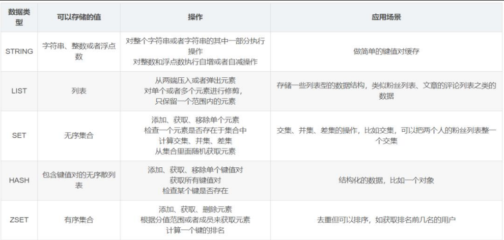
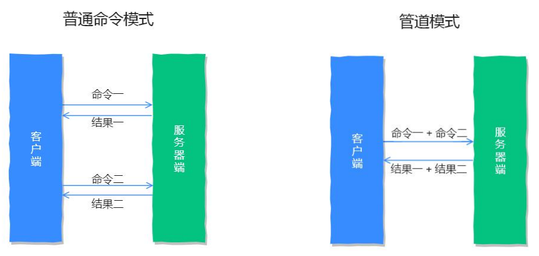
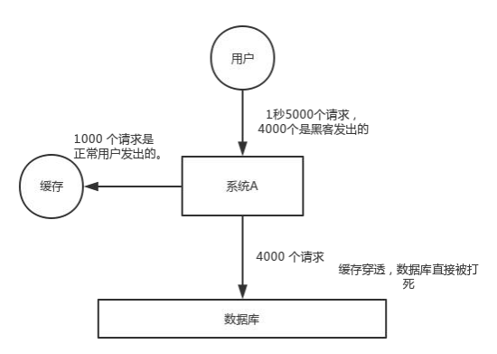
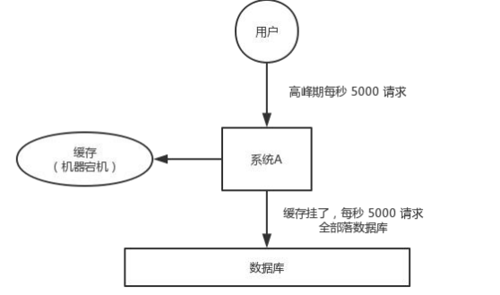
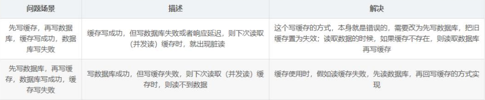

# Redis

Redis是一种key-value类型的内存数据库，其中key必须是字符串类型，value支持string(字符串)、hash(哈希/字典)、list(列表)、set(集合)以及zset(sorted set有序集合)这五种类型；

## 1.Redis的安装和登录

1.1 通过命令行：https://www.runoob.com/redis/redis-install.html

1. redis服务启动：  
    进入redis服务代码所在的文件夹中，启动对应的命令行**(需要保持打开不然不能开启服务器)**
    redis-server.exe redis.windows.conf
2. 连接redis -- redis的客户端命令行启动  
    进入redis客户端代码所在的文件夹中，启动对应的命令行  
    redis-cli.exe -h 127.0.0.1 -p 6379（也可以连远程的，-h表示主机名，-p表示端口号）

   修改密码
   另外打开一个cmd窗口–>输入redis-cli.exe回车—>config get requirepass获取密码（此时密码为空）—>config set requirepass 123456（设置密码123456）–>config get requirepass获取密码（此时提示需要密码）—>auth 123456（验证密码）—>config get requirepass获取密码（此时显示了刚设置好的密码）—>然后测试一下redis—>set name abc（加入姓名abc）—>get name（取出name）
                        
原文链接：https://blog.csdn.net/m0_52789121/article/details/126616192

1.2 通过小皮安装redis client2.0.0和登录

1.3 通过pycharm插件

## 2.Redis的增删改查

Redis的增删改查和Sql不同，Redis的增删改成根据不同数据种类有不同的操作。

### 2.1 Redis数据删除操作

删除：del

del name #  删除key为name的数据

自动过期时间/自动删除：

ttl name # 返回key为name的数据对应的过期秒数，-1表示不过期

EXPIRE name 60 # 给定key为name的数据的对应过期秒数为60

### 2.2 String类型数据的操作

String类型其实就是**对应python中的字符串和数值类型**

插入/更新：SET  
                set name 'xiaoming'  
                NOTE: 默认情况下，会进行覆盖行为

查询：GET  
                get name  
                NOTE: 如果获取的对应key不存在，那么返回Nil；如果key对应的类型不是String类型，那么报错

### 2.3 Hash类型数据的操作

Hash类型其实就是**字典类型,** hash的**field_name必须是字符串**，**field_value一般也必须是Redis的STRING类型**

插入/更新:  
                hset key field_name field_value 修改\增加单个  
                hmset key field_name1 field_value1 field_name2 field_value2 .... 修改\增加多个

查询:  
                hgetall key 查询所有  
                hmget key field_name1 field_name2 .... 查询多个

特殊删除：  
                hdel key field_name1 field_name2 ....

### 2.4 List类型数据的操作

 list就是**列表**，允许重复数据

	列表相关命令：https://www.runoob.com/redis/redis-lists.html

### 2.5 Set类型数据的操作

set就是集合，不允许重复数据  
        Set相关命令：https://www.runoob.com/redis/redis-sets.html

### 2.6 ZSet类型数据的操作

ZSet就是有**顺序的集合**，不允许重复数据  
        ZSet相关命令：https://www.runoob.com/redis/redis-sorted-sets.html

## 3.Pipeline管道技术

Redis管道技术Pipeline是一种最基础的加速优化方法；不过Pipeline中如果命令太多，可能会导致客户端等待时间过长，最终导致网络阻塞；另外如果redis采用的是集群模式，需要确保所有命令对应的key必须位于同一个槽(slot)或者机器上。

## 4.Redis可能遇到的问题

**缓存击穿**就是说某个 key 非常热点，访问非常频繁，处于集中式高并发访问的情况，当这个key 在失效的瞬间，大量的请求就击穿了缓存，直接请求数据库。常规的解决方案如下：

* 针对不会发生更新的数据可以考虑设置为永不过期；
* 针对更新不频繁并且缓存刷新耗时少的情况，可以采用分布式锁或者本地互斥锁保证少量请求能够请求数据库来重新构建缓存，其余线程直接等到锁释放后读取新缓存；

* 针对更新频繁或者缓存刷新耗时长的情况，可以采用定时线程在过期前主动构建缓存或者延后缓存过期时间的策略；

**缓存穿透**表示针对**异常请求**直接无法从缓存中提取数据，每次都需要直接查询数据库的情况，属于一种恶意的系统攻击场景。常规解决方案如下：

* 如果从数据库中没有查询到数据，那么直接在缓存中填充一个特殊值；

**缓存雪崩**是指由于**缓存服务器突然宕机或者大量key同时过期**，导致所有的操作均落到数据库上；常规解决方案如下：

* 事前：redis 高可用，主从+哨兵，redis cluster，避免全盘崩溃。缓存过期时间添加随机值。
* 事中：本地缓存 + 服务限流&降级，避免 MySQL 被打死。
* 事后：redis 持久化，一旦重启，自动从磁盘上加载数据，快速恢复缓存数据。

**数据一致性问题**一般是指数据库和redis之间的数据是否会存在不一致的情况，比如redis中的数据已经更新了，但是数据库中的数据还没有更新，那就是存在脏数据的情况，这个是只要使用redis作为缓存就必须考虑的一个问题。

‍
